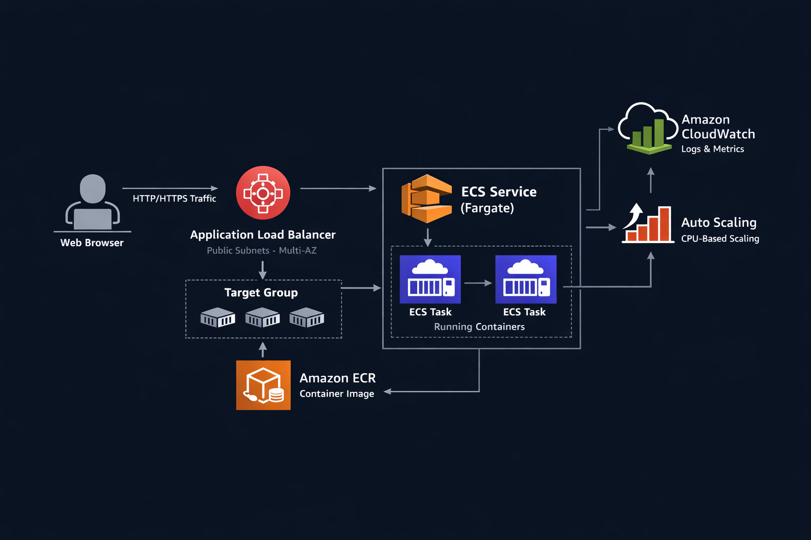

# 🚀 ECS Fargate DevOps Project 

This project demonstrates an end-to-end container deployment workflow on AWS — starting from a local Docker build to running a containerized application on ECS Fargate.

---




---

## 📌 Project Overview

Goal: Deploy a containerized Node.js application on AWS using modern DevOps best practices.

Current Status:

* ✅ Dockerized Node.js application
* ✅ Image pushed to Amazon ECR
* ✅ Deployed on ECS using Fargate
* ✅ Application accessible via Public IP

---

# 🧱 Part 1 – From Local Docker to Amazon ECR

## Step 1: Build Application

* Created a simple Node.js HTTP server
* Configured package.json

## Step 2: Dockerize the Application

Created a Dockerfile:

* Used Node 18 base image
* Set working directory
* Copied application files
* Installed dependencies
* Exposed port 3000
* Defined startup command

Built Docker image:

```
docker build -t ecs-demo-app .
```

Tested locally:

```
docker run -p 3000:3000 ecs-demo-app
```

Verified application at:

```
http://localhost:3000
```

---

## Step 3: Push Image to Amazon ECR

* Created private ECR repository
* Authenticated Docker using IAM role
* Tagged Docker image
* Successfully pushed image

Common Issue Faced:

Error:

```
no basic auth credentials
```

Root Cause:
Docker authentication is stored per-user and the EC2 user was not part of the docker group.

Fix:

```
sudo usermod -aG docker ubuntu
```

Logged out and reconnected to apply group changes.

Result:
Docker login succeeded and image push completed.

---

# 🚀 Part 2 – Deploying on ECS Fargate

## Step 1: Create ECS Cluster

* Created cluster using Fargate launch type
* Networking mode enabled

## Step 2: Create Task Definition

Configuration:

* Launch type: Fargate
* CPU: 0.25 vCPU
* Memory: 0.5 GB
* Container image: ECR image
* Port mapping: 3000 (TCP)

## Step 3: Create ECS Service

* Selected Fargate launch type
* Attached task definition
* Desired tasks: 1
* Enabled Auto-assign Public IP
* Used default VPC public subnets
* Configured Security Group to allow port 3000

## Step 4: Access Application

* Retrieved ENI public IP from running task
* Accessed application using:

```
http://<public-ip>:3000
```

Application successfully running on ECS Fargate.

---

# 🏗 Architecture (Current)

User → Public IP → ECS Service → Fargate Task → Container → ECR Image

---

# 🔐 Security Implementation

* Used IAM Role instead of storing AWS access keys
* Private ECR repository
* Security Group restricted to required port

---

# 📈 Scalability (Current State)

* Running 1 Fargate task
* Ready to enable Service Auto Scaling (next phase)

---

# 💰 Cost Consideration

* Using Fargate (pay per task)
* Small CPU and memory configuration
* Single running task

---

# 🤖 Next Phase (Upcoming)

* Attach Application Load Balancer
* Configure Target Group
* Enable Health Checks
* Add Auto Scaling Policies
* Convert entire setup to Terraform

---

# 🎯 Key Learnings So Far

* Docker image lifecycle
* ECR authentication flow
* Docker socket permission handling
* ECS architecture (Cluster, Task Definition, Service)
* Fargate networking model
* IAM role-based authentication best practice

---

